# 📊 SQL-analisis-influencer_crm

## 📖 Introducción

La base de datos **influencer_crm** forma parte de un proyecto más amplio orientado a la creación de un sistema de decisiones inteligente para campañas de marketing.  
Está diseñada para almacenar información sobre influencers, campañas de marketing, marcas y colaboraciones entre ellos.

Sobre esta base se aplican consultas SQL que permiten generar **inteligencia de negocio**.  
Cada consulta responde a preguntas clave de marketing y se traduce en **insights accionables** para optimizar inversión, seleccionar talento y maximizar el rendimiento de campañas.


---

## 🎯 Objetivo
Demostrar cómo los datos operativos de la db influencers_crm pueden convertirse en **herramientas estratégicas** para la toma de decisiones.  
A lo largo del análisis se exploran:
- Métricas de eficiencia (ROI en engagement y clics)  
- Rendimiento de campañas  
- Comportamiento de audiencia  
- Segmentación estratégica  

Todo ello con un enfoque práctico y orientado a resultados.

---

## 📋 Cada consulta incluye:
- **Pregunta de negocio** → qué queremos saber  
- **Código SQL** → formateado con bloque ```sql```  
- **Captura de resultados** → imagen desde MySQL Workbench  
- **Insight de negocio** → qué decisión tomar con esos números  

---

## 📌 Estructura del repositorio
- `/notebooks` → Jupyter Notebooks con las consultas y análisis  
- `/sql` → scripts SQL individuales  
- `/images` → capturas de pantalla de resultados  
- `README.md` → documentación principal  

---
# 📊 Guía de Consultas SQL - Influencer CRM

Este proyecto contiene 12 consultas SQL aplicadas a un CRM de influencers.  
Cada consulta responde a una pregunta clave de marketing y se traduce en insights accionables.

---

## 1. ROI Engagement
**Pregunta de negocio:** ¿Qué influencers generan mayor retorno en interacciones?   
📂 [Ver consulta completa](./sql/roi_engagement.sql)

📸 Resultado en MySQL Workbench (vista parcial):  


**Insight de negocio:**  

María García (ROI 5,91) y Ana López (ROI 5,15) → son las más eficientes: generan muchas interacciones con baja inversión.
Acción: priorizar su participación en campañas futuras.

Javier Torres (ROI 3,70) → alto volumen de interacciones, pero con inversión elevada.
Acción: usarlo en campañas de gran visibilidad, más que de eficiencia.

Elena Muñoz (ROI 2,06) y Diego Rivas (ROI 1,81) → menor eficiencia en costo por interacción.
Acción: reconsiderar su inclusión en campañas de alto presupuesto o renegociar condiciones.

🚀 **Conclusión estratégica:**
Optimizar inversión con María y Ana, usar a Javier para alcance masivo, y revisar contratos de Elena y Diego para balancear eficiencia y visibilidad.

---

## 2. ROI Clicks
**Pregunta de negocio:** ¿Qué influencers convierten mejor en clics?  
📂 [Ver consulta completa](./sql/roi_clicks.sql)

📸 Resultado en MySQL Workbench (vista parcial):  
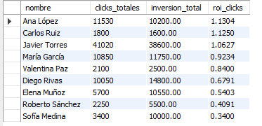

**Insight de negocio:**

María García y Ana López → mayor eficiencia en clicks por inversión, ideales para campañas orientadas a conversión.

Javier Torres → gran volumen de clicks, pero con menor eficiencia; útil para campañas de alcance masivo.

Elena Muñoz y Diego Rivas → baja eficiencia; conviene revisar condiciones o reservarlos para campañas de nicho.

🚀 **Conclusión estratégica:**

Priorizar a María y Ana para maximizar ROI en clicks, usar a Javier para visibilidad, y evaluar la relación costo-beneficio de Elena y Diego.

---

## 3. Selección de talento
**Pregunta de negocio:** ¿Qué influencers activos son recomendables para próximas campañas?  

📂 [Ver consulta completa](./sql/influencers_recomendados.sql)

📸 Resultado en MySQL Workbench (vista parcial):  
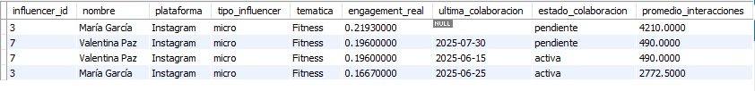

**Insight de negocio:**

Ana López cumple con los criterios de temática (Moda), supera el mínimo de engagement y está activa.
Su rendimiento histórico muestra buen nivel de interacciones y una colaboración reciente.
**Acción:** recomendarla como candidata prioritaria para la próxima campaña de moda.

---

## 4. Evaluación de campañas: Rentabilidad (Costo por interacción)
**Pregunta de negocio:** ¿Cuál es el costo promedio por interacción en cada campaña?  
 
📂 [Ver consulta completa](./sql/costo_por_interaccion.sql)

📸 Resultado en MySQL Workbench (vista parcial):  
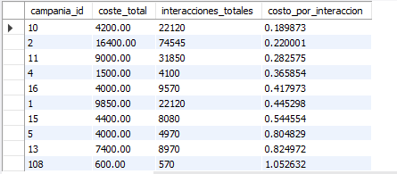

**Insight de negocio:** 

Campañas 2, 10 y 1 → más rentables, con menor costo por interacción; generan gran engagement con baja inversión.
Campañas 11 y 4 → rentabilidad intermedia, aún aceptables en eficiencia.
Campañas 15, 5, 13 y 12 → menos eficientes, con alto costo por interacción; requieren revisión de estrategia o renegociación de condiciones.
🚀 **Conclusión estratégica:**

Priorizar campañas con bajo costo por interacción para maximizar ROI, y ajustar presupuesto o estrategia en aquellas con baja eficiencia.

---

## 5. Análisis de contenido: Mejores temáticas por engagement real
**Pregunta de negocio:** ¿Qué temáticas generan mayor engagement promedio?  
  
📂 [Ver consulta completa](./sql/engagement_tematica.sql)

📸 Resultado en MySQL Workbench (vista parcial):

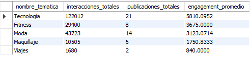

**Insight de negocio:** 

Fitness y Tecnología destacan como las temáticas con mayor engagement promedio, generando más interacciones por publicación.
Moda muestra un engagement menor en comparación, aunque sigue siendo relevante.
**Acción estratégica:**

priorizar campañas en torno a Fitness y Tecnología para maximizar interacción, y mantener Moda como temática complementaria según objetivos de marca.

---

## 6. Evolución del engagement en el tiempo
**Pregunta de negocio:** ¿Cómo evoluciona el engagement de un influencer en distintos periodos?  

📂 [Ver consulta completa](./sql/evolucion_engagement.sql)

📸 Resultado en MySQL Workbench (vista parcial):

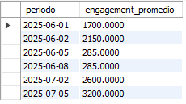

**Insight de negocio:**

Se observa una tendencia creciente en el engagement a lo largo del tiempo.
Los picos en julio sugieren que la segunda campaña tuvo mayor impacto en la audiencia.
Las variaciones diarias permiten identificar qué contenidos generan más interacción.
**Acción estratégica:**

reforzar las prácticas de publicación que dieron mejores resultados y ajustar las que mostraron caídas.
📌 Nota: El procedimiento almacenado también puede cubrir análisis semanales y mensuales, lo que permite comparar patrones de engagement en diferentes escalas de tiempo.

---

## 7. Medición de ventas: Tasa de conversión de códigos de descuento
**Pregunta de negocio:** ¿Qué códigos de descuento generan más ventas y ROI?  

📂 [Ver consulta completa](./sql/conversion_codigos.sql)

📸 Resultado en MySQL Workbench (vista parcial):
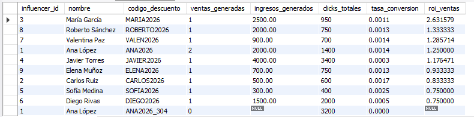

**Insight de negocio:** 

María García es la influencer más rentable, con el ROI más alto y una tasa de conversión sólida: ideal para campañas orientadas a ventas directas.
Roberto Sánchez, Valentina Paz y Ana López muestran un buen equilibrio entre ingresos y conversión, recomendables para mantener consistencia en resultados.
Javier Torres genera ingresos elevados pero con baja tasa de conversión, lo que lo posiciona mejor en campañas de alcance y branding.
Elena Muñoz, Carlos Ruiz, Sofía Medina y Diego Rivas presentan menor eficiencia en ROI y conversión, por lo que conviene asignarles campañas de visibilidad o engagement en lugar de performance puro.

---

## 8. Segmentación estratégica: Matriz de rendimiento y coste
**Pregunta de negocio:** ¿Cómo clasificar influencers según ROI y coste?  

📂 [Ver consulta completa](./sql/matriz_rendimiento_coste.sql)

📸 Resultado en MySQL Workbench (vista parcial):

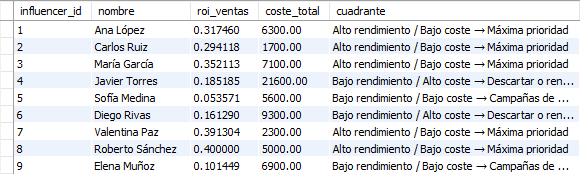

**Insight de negocio:** 

Prioridad máxima: Roberto Sánchez, Valentina Paz, María García, Ana López y Carlos Ruiz → combinan ROI alto con costes bajos, ideales para escalar campañas.
Evaluación de presupuesto: ninguno en este corte, lo que simplifica la asignación de recursos.
Bajo riesgo: Sofía Medina y Elena Muñoz → ROI bajo pero costes moderados, útiles para campañas de prueba o visibilidad.
Descartar/renegociar: Javier Torres y Diego Rivas → ROI insuficiente frente a costes elevados, requieren revisión de estrategia o renegociación de condiciones.

---

## 9. Optimización de frecuencia
**Pregunta de negocio:** ¿Cuántas publicaciones semanales son óptimas para maximizar engagement?  
 
📂 [Ver consulta completa](./sql/frecuencia_optima.sql)

📸 Resultado en MySQL Workbench (vista parcial):

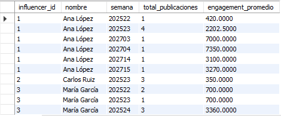

**Insight de negocio:** 

Frecuencia óptima: los influencers con 2–3 publicaciones por semana (ej. María García, Roberto Sánchez, Valentina Paz) mantienen un engagement promedio alto y estable.
Saturación detectada: cuando la frecuencia supera las 4–5 publicaciones semanales (ej. Sofía Medina, Javier Torres), el engagement promedio tiende a caer, indicando sobreexposición de la audiencia.
Publicaciones aisladas (1 por semana) muestran picos de engagement muy altos (ej. Ana López, Diego Rivas), lo que sugiere que la audiencia responde mejor a contenidos menos frecuentes pero más relevantes.
**Recomendación estratégica:** 

mantener un rango de 2–3 publicaciones semanales como estándar, reservando publicaciones adicionales solo para campañas especiales, evitando la saturación y maximizando el engagement.

---

## 10. Lealtad del influencer: Repetibilidad y mejora en el tiempo
**Pregunta de negocio:** ¿Los influencers mejoran, mantienen o declinan su rendimiento en colaboraciones sucesivas?  
 
📂 [Ver consulta completa](./sql/lealtad_influencer.sql)

📸 Resultado en MySQL Workbench (vista parcial):

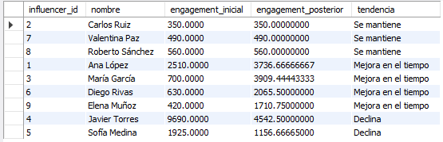

**Insight de negocio:** 

---

## 11. Rendimiento por plataforma y formato
**Pregunta de negocio:** ¿Qué plataformas y formatos generan mayor engagement promedio?  
**Insight esperado:** Comparación de rendimiento por tipo de contenido.  
📂 [Ver consulta completa](./sql/rendimiento_plataforma_formato.sql)

📸 Resultado en MySQL Workbench (vista parcial):

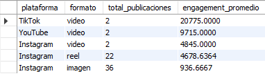
---

## 12. Crecimiento de audiencia: Ganancia de seguidores durante la campaña
**Pregunta de negocio:** ¿Qué campañas generan mayor crecimiento de seguidores?  
**Insight esperado:** Tasa de crecimiento relativa de audiencia.  
📂 [Ver consulta completa](./sql/crecimiento_audiencia.sql)

📸 Resultado en MySQL Workbench (vista parcial):
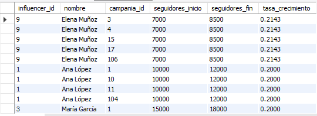
---

## 📌 Conclusión
Este proyecto muestra cómo las consultas SQL permiten transformar datos en **inteligencia de negocio real**.  
La información obtenida ayuda a:
- Optimizar la inversión en campañas  
- Seleccionar el mejor talento  
- Maximizar el rendimiento de las estrategias de marketing con influencers  


