# 📊 SQL-analisis-influencer_crm

## 📖 Introducción

La base de datos **influencer_crm** forma parte de un proyecto más amplio orientado a la creación de un sistema de decisiones inteligente para campañas de marketing.  
Está diseñada para almacenar información sobre influencers, campañas de marketing, marcas y colaboraciones entre ellos.

Sobre esta base se aplican consultas SQL que permiten generar **inteligencia de negocio**.  
Cada consulta responde a preguntas clave de marketing y se traduce en **insights accionables** para optimizar inversión, seleccionar talento y maximizar el rendimiento de campañas.


---

## 🎯 Objetivo
Demostrar cómo los datos operativos de la db influencers_crm pueden convertirse en **herramientas estratégicas** para la toma de decisiones.  
A lo largo del análisis se exploran:
- Métricas de eficiencia (ROI en engagement y clics)  
- Rendimiento de campañas  
- Comportamiento de audiencia  
- Segmentación estratégica  

Todo ello con un enfoque práctico y orientado a resultados.

---

## 📋 Cada consulta incluye:
- **Pregunta de negocio** → qué queremos saber  
- **Código SQL** → formateado con bloque ```sql```  
- **Captura de resultados** → imagen desde MySQL Workbench  
- **Insight de negocio** → qué decisión tomar con esos números  

---

## 📌 Estructura del repositorio
- `/notebooks` → Jupyter Notebooks con las consultas y análisis  
- `/sql` → scripts SQL individuales  
- `/images` → capturas de pantalla de resultados  
- `README.md` → documentación principal  

---
# 📈 Guía de Consultas Analíticas

Este proyecto contiene 12 consultas SQL aplicadas a un CRM de influencers.  
Cada consulta responde a una pregunta clave de marketing y se traduce en insights accionables.

---

## 1. ROI Engagement
**Pregunta de negocio:** ¿Qué influencers generan mayor retorno en interacciones?   
📂 [Ver consulta completa](./sql/roi_engagement.sql)

📸 Resultado en MySQL Workbench (vista parcial):  
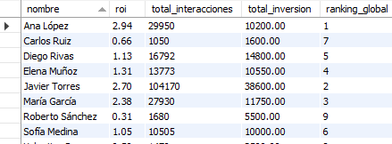

**Insight de negocio:**  

Ana López lidera con el ROI más alto (2.94), logrando gran eficiencia: pocas inversiones y alto volumen de interacciones.

Javier Torres ocupa el segundo lugar (2.70) con un volumen masivo de interacciones (más de 100k), lo que lo convierte en un perfil clave para campañas de alcance masivo.

María García mantiene un ROI sólido (2.38) con inversión moderada, lo que la hace confiable para campañas balanceadas entre costo y rendimiento.

Elena Muñoz y Diego Rivas muestran ROI intermedio (1.31 y 1.13), útiles para sostener consistencia pero sin picos de eficiencia.

Carlos Ruiz, Sofía Medina y Roberto Sánchez presentan ROI bajo (<1.1), lo que indica que sus campañas generan menos retorno por cada peso invertido.

🚀 **Conclusión estratégica:**
La estrategia debería priorizar a Ana López como referente de eficiencia y a Javier Torres para campañas de gran alcance. María García es ideal como perfil versátil que combina buen ROI con inversión moderada. El resto del grupo puede mantenerse en campañas de soporte o visibilidad, pero con expectativas controladas en términos de conversión y retorno.

---

## 2. ROI Clicks
**Pregunta de negocio:** ¿Qué influencers convierten mejor en clics?  
📂 [Ver consulta completa](./sql/roi_clicks.sql)

📸 Resultado en MySQL Workbench (vista parcial):  
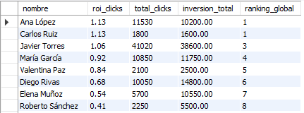

**Insight de negocio:**

Ana López y Carlos Ruiz comparten el ROI por clics más alto (1.13), aunque con perfiles distintos: Ana logra volumen considerable (11.530 clics) mientras Carlos lo hace con bajo volumen (1.800), lo que sugiere eficiencia en ambos extremos.

Javier Torres se posiciona tercero (ROI 1.06) pero con un volumen masivo de clics (41.020), lo que lo convierte en un activo clave para campañas de gran alcance.

María García y Valentina Paz muestran ROI moderado (0.92 y 0.84), útiles para mantener consistencia pero sin picos de eficiencia.

Diego Rivas, Elena Muñoz y Roberto Sánchez presentan ROI bajo (<0.7), lo que indica menor retorno por inversión y necesidad de reevaluar su rol en campañas de performance.

🚀 **Conclusión estratégica:**

La estrategia debería priorizar a Ana López y Javier Torres como perfiles estrella: Ana por su eficiencia y Javier por su alcance masivo. Carlos Ruiz es un caso interesante de alta eficiencia con bajo volumen, ideal para pruebas de nicho o campañas de bajo presupuesto. María García y Valentina Paz pueden sostener campañas de soporte con ROI aceptable. El resto del grupo requiere renegociación o asignación a campañas de visibilidad, ya que su aporte en conversión es limitado.

---

## 3. Selección de talento
**Pregunta de negocio:** ¿Qué influencers activos son recomendables para próximas campañas?  

📂 [Ver consulta completa](./sql/Selección_de_Talento.sql)

📸 Resultado en MySQL Workbench (vista parcial):  
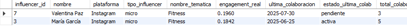

**Insight de negocio:**

Valentina Paz (micro influencer en Instagram, temática Fitness) muestra un engagement real de 0.1960, con 3 colaboraciones registradas y una última colaboración en estado pendiente. Esto indica potencial de crecimiento, pero aún con baja maduración de campañas.

María García (también micro influencer en Instagram, temática Fitness) presenta un engagement real de 0.1842, con 5 colaboraciones y una última colaboración en estado activa. Su historial más amplio y continuidad en campañas la posicionan como un perfil más consolidado.

Ambos perfiles superan el umbral mínimo de engagement (≥0.01), lo que valida su inclusión en el reporte de selección de talento.

---

## 4. Evaluación de campañas: Rentabilidad (Costo por interacción)
**Pregunta de negocio:** ¿Cuál es el costo promedio por interacción en cada campaña?  
 
📂 [Ver consulta completa](./sql/costo_por_interaccion.sql)

📸 Resultado en MySQL Workbench (vista parcial):  
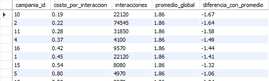

**Insight de negocio:** 

Las campañas 10, 2 y 11 destacan por tener el costo por interacción más bajo (0.19–0.28), muy por debajo del promedio global (1.86). Esto significa que generan interacciones de manera altamente eficiente, con diferencias negativas de más de -1.5 respecto al promedio.

La campaña 2 además combina eficiencia con volumen alto de interacciones (74.545), lo que la convierte en un caso de éxito tanto en escala como en costo.

Las campañas 4, 16 y 1 mantienen costos moderados (0.37–0.45), aún por debajo del promedio, pero con menor volumen de interacciones, lo que las hace útiles para sostener presencia sin ser las más rentables.

Las campañas 15 y 5 muestran costos más cercanos al promedio (0.54 y 0.80), con diferencias menores (-1.32 y -1.06). Aunque siguen siendo más eficientes que el promedio, su margen de ventaja es reducido.

🚀 **Conclusión estratégica:**

La estrategia de marketing debería concentrar recursos en las campañas más eficientes (10, 2, 11), usar las intermedias como soporte, y evaluar ajustes en las menos competitivas para mantener la rentabilidad global.

---

## 5. Análisis de contenido: Mejores temáticas por engagement real
**Pregunta de negocio:** ¿Qué temáticas generan mayor engagement promedio?  
  
📂 [Ver consulta completa](./sql/engagement_tematica.sql)

📸 Resultado en MySQL Workbench (vista parcial):

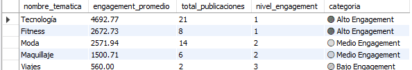

**Insight de negocio:** 

Tecnología y Fitness son las temáticas con mayor engagement promedio (4692 y 2673 respectivamente), clasificadas en el nivel Alto Engagement. Esto indica que concentran la atención y generan interacciones de calidad, siendo las más atractivas para campañas de performance.

Moda y Maquillaje se ubican en el rango Medio Engagement (2572 y 1501), con un volumen de publicaciones intermedio. Son temáticas estables que pueden sostener campañas de visibilidad y branding, aunque con menor impacto directo que las de alto nivel.

Viajes aparece en el nivel Bajo Engagement (560), con pocas publicaciones y baja interacción, lo que sugiere saturación o menor relevancia en la audiencia actual.

**Acción estratégica:**

Priorizar campañas en torno a Fitness y Tecnología para maximizar interacción, y mantener Moda y Maquillaje como temática complementaria según objetivos de marca.

---

## 6. Evolución del engagement en el tiempo
**Pregunta de negocio:** ¿Cómo evoluciona el engagement de un influencer en distintos periodos?  

📂 [Ver consulta completa](./sql/evolucion_engagement.sql)

📸 Resultado en MySQL Workbench (vista parcial):

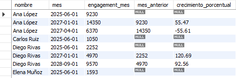

**Insight de negocio:**

Ana López: muestra un crecimiento inicial fuerte (+55,47% entre junio 2025 y enero 2027), pero luego una caída abrupta (-55,61% en abril 2027). Esto refleja volatilidad: capacidad de escalar, pero con riesgo de saturación o pérdida de interés.

Diego Rivas: presenta una evolución muy positiva y sostenida. Creció +120,69% en enero 2027 y luego +92,56% en septiembre 2028. Su trayectoria indica consolidación y capacidad de mantener el interés de la audiencia en el tiempo.

Carlos Ruiz y Elena Muñoz: solo tienen registros iniciales sin evolución posterior, lo que limita el análisis. Necesitan más datos para evaluar tendencias de crecimiento o declive.

**Conclusión estratégica:**
Reforzar las prácticas de publicación que dieron mejores resultados y ajustar las que mostraron caídas.

---

## 7. Medición de ventas: Tasa de conversión de códigos de descuento
**Pregunta de negocio:** ¿Qué códigos de descuento generan más ventas y ROI?  

📂 [Ver consulta completa](./sql/Tasa_de_Conversion.sql)

📸 Resultado en MySQL Workbench (vista parcial):
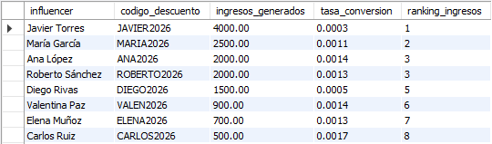

**Insight de negocio:** 

Javier Torres lidera en ingresos generados (4000) aunque con una tasa de conversión muy baja (0.0003). Esto indica que logra volumen de ventas, pero necesita muchos clics para concretar cada transacción.

María García y Ana López se posicionan en segundo y tercer lugar en ingresos (2500 y 2000), con tasas de conversión más altas (0.0011–0.0013), lo que refleja mejor eficiencia en transformar clics en ventas.

Roberto Sánchez iguala a Ana López en ingresos (2000) y tasa de conversión (0.0013), mostrando consistencia aunque sin destacar en volumen.

Valentina Paz, Elena Muñoz y Carlos Ruiz presentan tasas de conversión relativamente más altas (0.0013–0.0017), pero con ingresos bajos (900–700–500). Son perfiles eficientes en proporción, pero aún con poco alcance.

Diego Rivas queda en un punto intermedio: ingresos moderados (1500) pero con tasa de conversión baja (0.0005), lo que sugiere que necesita optimizar la calidad de sus clics.

**Conclusión estratégica**

La estrategia debería priorizar a Javier Torres por volumen y a María García/Ana López por eficiencia, mientras que los perfiles con ingresos bajos pero buena conversión pueden ser testeados en campañas específicas para evaluar su potencial de escalamiento.

---

## 8. Segmentación estratégica: Matriz de rendimiento y coste
**Pregunta de negocio:** ¿Cómo clasificar influencers según ROI y coste?  

📂 [Ver consulta completa](./sql/matriz_rendimiento_coste.sql)

📸 Resultado en MySQL Workbench (vista parcial):

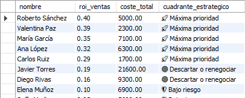

**Insight de negocio:** 

Roberto Sánchez, Valentina Paz, María García, Ana López y Carlos Ruiz se ubican en el cuadrante de “Máxima prioridad”: presentan ROI de ventas relativamente alto en proporción a sus costes, lo que los convierte en perfiles eficientes y estratégicos para maximizar retorno.

Javier Torres y Diego Rivas aparecen en el cuadrante de “Descartar o renegociar”: aunque generan ingresos, sus costes son elevados y su ROI bajo, lo que reduce la rentabilidad de sus campañas.

Elena Muñoz se clasifica en “Bajo riesgo”: su ROI es bajo (0.10), pero también su coste total es moderado. Puede mantenerse en campañas de soporte o nicho sin comprometer demasiado presupuesto.

**Conclusión estratégica**

La estrategia debe concentrar recursos en los perfiles eficientes, optimizar o renegociar los de bajo ROI y alto coste, y usar los de bajo riesgo como soporte secundario.

---

## 9. Optimización de frecuencia
**Pregunta de negocio:** ¿Cuántas publicaciones semanales son óptimas para maximizar engagement?  
 
📂 [Ver consulta completa](./sql/frecuencia_optima.sql)

📸 Resultado en MySQL Workbench (vista parcial):

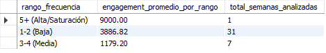

**Insight de negocio:** 

El rango 1–2 publicaciones semanales muestra un engagement promedio sólido (3886.82) y es el más representativo, con 31 semanas analizadas. Esto confirma que la frecuencia baja pero constante mantiene la atención de la audiencia sin saturarla.

El rango 3–4 publicaciones semanales reduce el engagement promedio a 1179.20, con 7 semanas analizadas, lo que evidencia que aumentar la frecuencia más allá de 2 publicaciones tiende a disminuir la interacción.

El rango 5+ publicaciones semanales presenta un engagement muy alto (9000.00), pero solo en 1 semana analizada. Esto sugiere un caso excepcional o un pico puntual, no una tendencia sostenible.
**Cloncusión estratégica:** 

Mantener un rango de 2–3 publicaciones semanales como estándar, reservando publicaciones adicionales solo para campañas especiales, evitando la saturación y maximizando el engagement.

---

## 10. Lealtad del influencer: Repetibilidad y mejora en el tiempo
**Pregunta de negocio:** ¿Los influencers mejoran, mantienen o declinan su rendimiento en colaboraciones sucesivas?  
 
📂 [Ver consulta completa](./sql/Trayectoria_de_rendimiento.sql)

📸 Resultado en MySQL Workbench (vista parcial):


**Insight de negocio:**

Este análisis permite ver si un influencer mantiene, mejora o declina su engagement en cada colaboración.

Diego Rivas (ejemplo de tu tabla) aparece con su primera colaboración en estado Estable: engagement inicial de 2485 sin comparación previa.

A medida que se sumen más colaboraciones, se podrá identificar si su tendencia es de mejora sostenida (lealtad y crecimiento), declive (pérdida de interés) o estabilidad (rendimiento constante).

**Conclusión estratégica:**
 Esta consulta permite transformar el engagement en un indicador de fidelidad y potencial futuro, ayudando a segmentar influencers en estrella, confiables o en riesgo.

---

## 11. Rendimiento por plataforma y formato
**Pregunta de negocio:** ¿Qué plataformas y formatos generan mayor engagement promedio?  
  
📂 [Ver consulta completa](./sql/rendimiento_plataforma_formato.sql)

📸 Resultado en MySQL Workbench (vista parcial):

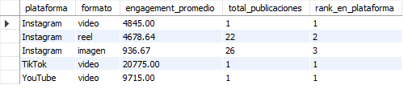

**Insight de negocio:** 

TikTok (video) lidera con un engagement promedio altísimo (20.775), incluso con pocas publicaciones. Esto confirma que el formato audiovisual corto es el más potente para captar atención.

YouTube (video) ocupa el segundo lugar (9.715), ideal para contenidos más largos y profundos, con gran capacidad de mantener interacción.

Instagram (video y reels) muestran un rendimiento competitivo (4.845 y 4.678), siendo los formatos más efectivos dentro de la plataforma. Los reels destacan por volumen de publicaciones (22), lo que indica consistencia y preferencia de la audiencia.

Instagram (imagen) queda muy por debajo (936), evidenciando que los formatos estáticos generan menor interacción frente a los audiovisuales.

**Estrategia:** 
El video es el motor del engagement, y las marcas deberían concentrar recursos en formatos audiovisuales, relegando los contenidos estáticos a un rol secundario.


---

## 12. Crecimiento de audiencia: Ganancia de seguidores durante la campaña
**Pregunta de negocio:** ¿Qué campañas generan mayor crecimiento de seguidores?  
  
📂 [Ver consulta completa](./sql/crecimiento_audiencia.sql)

📸 Resultado en MySQL Workbench (vista parcial):

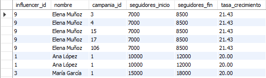

**Insight de negocio:** 

Elena Muñoz es un perfil confiable y repetible: su crecimiento estable en distintas campañas la convierte en un activo seguro para mantener resultados constantes.

Ana López y María García destacan por su capacidad de generar incrementos significativos de seguidores en una sola campaña, lo que los hace ideales para acciones de alto impacto.

La estrategia debería combinar perfiles de crecimiento estable (Elena) con perfiles de alto impacto puntual (Ana y María), asegurando tanto continuidad como escalabilidad en la audiencia.

**Conclusión estratégica**
Elena aporta consistencia, Ana y María aportan volumen, y juntos conforman una base sólida para campañas que busquen tanto fidelización como expansión rápida.

---

## 🧠 Conclusión General
El uso de SQL analítico avanzado (CTEs, funciones de ventana, rankings, análisis temporal y de frecuencia) permite extraer valor estratégico de los datos operativos de un CRM de influencers.
Cada una de las 12 consultas entrega insights accionables que responden a preguntas de negocio reales:

Dónde invertir para maximizar ROI.

A quién elegir para cada objetivo (eficiencia, alcance, conversión, crecimiento).

Cómo ajustar la estrategia de contenido (frecuencia, formato, plataforma).

Cuándo renegociar o descartar un influencer.

Este repositorio es una demostración práctica de cómo los datos pueden guiar decisiones de marketing con precisión.  


